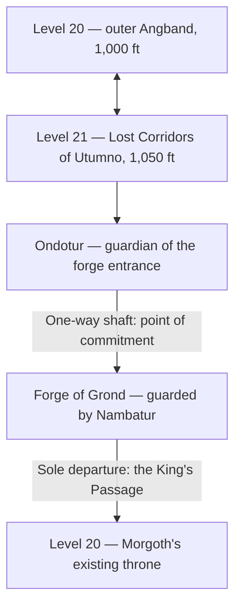

# Unique monsters for tiles 21,13–21,24

Implementation and design record, updated 2026-09-11. The nine monsters and selected abilities are implemented in the working tree on branch `0.9.8`; the save format is `0.9.8.5`, with version-gated reads of earlier saves. The level-21 and forge-route sections below remain future design, as requested. Combat values are starting values, not playtested balance.

Implemented abilities: Angacirca's stationary Zone of Control; Nambatur's immediate, resource-costed Smite and following recovery; Langon's Fast-to-Very-Fast Sprinting; Ringwion's breakable Concentration; Dúron's Dodging; the existing Easterling warrior's shield-only Blocking in place of Flanking; and Carcharoth's Vengeance with his ordinary bite reduced to `2d12`. The other abilities reviewed below remain future candidates. Monster blows remain alternatives, not a consecutive attack sequence.

## Implemented availability

- New stable monster IDs are **403–411**, in tile order: Ringwion, Helcamo, Lhamthanc, Angacirca, Langon, Dúron, Fankil, Ondotur, Nambatur. Existing IDs/GUIDs are preserved. Old Boldog (76) is now **Baugon, the Merciless**, an ordinary Orc captain with the same combat stats.
- Ringwion, Angacirca, Langon and Dúron enter normal allocation at their stated minimum tiers. Their earlier preferred depth ranges are design targets, not hard upper limits; `FORCE_DEPTH` prevents earlier allocation.
- **Lhamthanc's hoard (vault 521)** is authored for levels 19–20. It has shallow-water flying shortcuts and connected dry routes; chasms would prevent generation at the current throne depth. **Fankil's embassy (vault 522)** is authored for levels 14–15 with exactly two Easterling warriors and two archers. Those warriors now have Blocking.
- **Helcamo, Ondotur and Nambatur are defined but reserved.** Rarity zero and `SPECIAL_GEN | SPECIAL_VAULT_ONLY`, without authored spawns, keep them out of normal allocation, summons and quest selection until their future locations exist. They remain available for explicit development/test placement.
- The playable depth limit, stairs, throne transitions and forge travel are unchanged by this work. No physical level 21 or new forge destination has been implemented.

The new module is `src/monster/monster-abilities.c`. Six new `RF5` flags are parsed from `F:` lines; `H:<dice>` identifies the shield component already included in a monster's ordinary `P:` protection. Ability history, charge/recovery state and learned abilities survive saving; older records receive safe defaults, and formerly unused race slots cannot give new uniques a population cap above one.

## Agreed direction

- Tiles `(21,13)` and `(21,14)` are both ice raukar, following the artist's identification. Give them different combat roles.
- Tile `(21,18)` is the brown winged dragon. Propose Lhamthanc, a powerful unique of a discarded nonbreathing winged strain. Compare him with the existing tier-24 flying drakes. His experimental origin does not make him weak or shallow.
- Tile `(21,19)` is a sickle-bearing Boldog: an Orc-shaped Maia, classified as both Orc and Rauko.
- Tile `(21,20)` becomes Langon, interpreted as an armed wind spirit and messenger. This replaces the proposed swordsman Celegon for this tile.
- Tile `(21,21)` is an agile shadow spirit; `(21,23)` is the massive stone spirit.
- Tile `(21,22)` is Fankil, an emissary and corrupter of Men.
- Fankil uses both `MAN` and `RAUKO`: an assumed human form and a spirit's nature. He appears at levels 14–15 with an escort of ordinary Easterlings.
- Tile `(21,24)` is Nambatur, a pale smith with a hammer. Hammer is the working interpretation of the ambiguous weapon.
- Keep `(21,15)` for the existing Green Great Dragon, and `(21,16–17)` for the existing flying cold-drake and flying fire-drake. They are outside these nine new unique drafts.
- Add a real **level 21, 1,050 feet**, below Morgoth's level 20. It consists of frozen lost Utumno corridors cut by rivers of lava.
- A shaft on level 21 leads into a **unique forge vault where Morgoth made Grond**. The forge's sole departure leads **directly to Morgoth's throne on level 20**.
- Ordinary Orcs and humans remain low-level enemies. They do not supply the fighting population, escorts, or encounter budget of level 21 or the forge. Angacirca is the deliberate exception in appearance: a deep-level Maia in Orc form.
- Introduce Fankil, Langon, Ringwion and Angacirca earlier. Dúron belongs to outer level 20; Lhamthanc remains an exceptional late vault encounter. Helcamo occupies the frozen galleries; Ondotur guards the forge entrance on level 21, and Nambatur guards the forge itself. Each unique has one encounter identity per run, with no scaled second incarnation below.

## The new route — future level work

The user's fixed requirements are level 21, its frozen/lava environment, the shaft into Grond's forge, and the forge's exclusive throne destination. The recommended access and encounter structure below develops those requirements; it is not existing travel behaviour.

**Recommended access.** Place a discoverable descent in outer level 20, reachable before entering the throne encounter. Keep an ordinary return from level 21 to outer level 20 until the player chooses the forge shaft. This makes exploring Utumno an optional risk with a recoverable early decision. Reaching level 21 must not itself start the Silmaril escape phase.

**The shaft commits the player.** Show an explicit description before descent: the shaft cannot be climbed back, and the forge's remaining passage leads into the throne hall. This is an actual area transition, not a generic two-floor shaft or a chasm damage roll. Its landing is solid ground outside the first enemy's immediate attack range.

**Forge destination.** Treat the forge as a named, separately identified destination. The user has not requested a whole ordinary level 22; the implementation must choose a region/sublevel representation without confusing it with physical level 21 or monster tier 22. Its one-way route is represented physically by a ruined descent and Morgoth's private rising passage, rather than unexplained teleportation.

**Only one departure.** There is no usable stair back to level 21, random stair to another depth, recall shortcut, or accidental chasm/level-teleport escape from the forge. Any applicable travel mechanics must preserve this contract. On arrival at the throne, the forge passage closes behind the player. Forward progress does not depend on a random key drop or necessarily on killing Nambatur: the anvil/reward chamber can be contested while the passage remains reachable by fighting, stealth, or diversion.

**Same throne, same history.** Return at a designated solid landing directly within the throne hall, outside immediate surrounding melee positions. Preserve Morgoth, his Crown and Silmarils, unique deaths, the truce/hostility history, and whether the escape is already underway. The transition must not create a second Morgoth, refill a defeated encounter, grant another truce, or start escape merely because physical depth decreased from 21 to 20. A departure from the forge must not require traversing the outer floor again.

**Once per run.** The unique forge, its rewards, and its custodian are initialized once. Revisiting the route or saving/loading cannot renew forge uses, treasure, guardians, or throne state. How inactive areas are retained is implementation work, not implied by an ordinary depth change.

## Why Utumno can be frozen and fiery

Tolkien directly associates Melkor with cold and fire, including furnaces beneath the mountains, in *The Silmarillion*, "Of the Beginning of Days," printed p. 27. Utumno's deep fires and hidden surviving chambers also provide a foundation for the ancient inhabitants. Frozen halls beside subterranean lava are a fitting elaboration of these themes. [Primary text sample](https://media.public.gr/Books-PDF/9780261102736-0000886.pdf), [Utumno and chapter references](https://tolkiengateway.net/wiki/Utumno)

Tolkien describes Grond as Morgoth's great hammer in the combat with Fingolfin; I did not find a reliable attribution of its exact maker or forging location. **In Sil-More's history, this is where Morgoth made Grond**, as specified by the user. The traversable Angband–Utumno connection and the direct throne passage are also game geography, rather than a recovered Tolkien map. [Grond](https://tolkiengateway.net/wiki/Grond_%28Hammer_of_the_Underworld%29), [Angband](https://tolkiengateway.net/wiki/Angband)

Nambatur is the forge's surviving custodian and former attendant, not the maker of Grond. Morgoth has already taken the finished weapon away: the player finds its anvil, great working spaces and tools, not another Grond available as loot. The old commented-out "Ultimate Forge" idea in `lib/edit/vault.txt` is inspiration only, not an implemented vault or travel route.

## Level 21: landscape and inhabitants — future level work

The level should feel largely abandoned. A few powerful, ancient inhabitants make crossing it dangerous; a dense conventional garrison would weaken that identity.

| Region | Appearance and traversal | Suitable inhabitants | Tactical purpose |
| --- | --- | --- | --- |
| Frozen galleries | Long frost-covered corridors, broken northern gates, side alcoves | Helcamo; sparse Ringraukar and ancient sapphire serpents | Builds on earlier frost encounters; alternate dry paths allow withdrawal |
| Lava rifts | Bright lava rivers divided by broad stone bridges and cooled banks | Ururaukar; one ancient ruby serpent in a selected encounter | Ranged fire pressure and route choice; solid-ground crossings are always available |
| Unlit foundations | Dark lateral tunnels away from lava light | A Gwathrauko or an isolated Nameless thing | Builds on Dúron's earlier darkness encounter; avoid multiplying unseen threats |
| Broken roots and forge entrance | A broad approach hall before the one-way shaft, crossed by cracks and surviving pillars | Ondotur alone as the entrance guardian | Slow pursuit through stone; two solid approach/retreat loops allow fighting, diversion or evasion before commitment |
| Sealed hot galleries | A side passage near the forge approach | At most one Ururauko, separated from Ondotur | An optional furnace attendant; do not block both approach loops |

**Terrain contract.** Use actual existing ice terrain for selected frozen stretches, and frosted-looking ordinary stone for safe staging floors. Ice currently gives grounded players and monsters **-2 attack and -2 evasion**; flying monsters avoid those footing penalties. Cold resistance does not grant better traction. Consequently the stat table gives base values: Ringwion and Helcamo also take the existing penalty when grounded on actual ice. Provide patches of ordinary stone on which the player can choose to fight. No new random sliding, global Slow, or automatic cold damage is added. Shallow water has separate movement consequences and is not a substitute for ice.

**Lava contract.** No required route asks the player to swim in lava, fly, or own a specific resistance item. Use bridges and cooled banks. In current monster rules, fire resistance protects from lava exposure, whereas a non-resistant flier can take **40 damage per exposure**; a grounded non-resistant monster is killed. Normal path selection rejects lava without fire resistance, but placement/forced movement can still put a flier there. Langon and Lhamthanc therefore gain no blanket lava safety from flight. Deliberate player exposure can remain deadly, but the shaft landing, forge arrival, and direct throne arrival are never hazardous terrain.

**Light and darkness.** Lava is a source of light. Shadow inhabitants belong in darker lateral passages; their darkness should not extinguish an entire lava river. Illumination is a visibility advantage, not automatic light damage. Helcamo stays on frozen ground rather than casually patrolling fire to which he is vulnerable.

**Fewer encounters, greater consequence.** The deep route contains **Helcamo** at the frozen gate, **Ondotur at the forge entrance**, and **Nambatur inside the forge**. Ondotur occupies the broad approach on the level-21 side of the shaft; Nambatur cannot join that fight from the other destination. These are guardians of spaces, not mandatory kill counters. Reaching the shaft requires dealing with Ondotur's presence by combat, stealth or drawing him aside. Earlier uniques are not reassigned here or resurrected after an earlier defeat.

**Ordinary population.** Use sparse raukar, ancient serpents and drakes appropriate to their terrain. Hithraukar and Unrelenting horrors are rare optional threats and should not be added beside another controller by default. Great cold/fire-drakes can occupy optional side chambers. The existing tier-24 flying drakes are exceptional encounters, not filler newly justified by a physical floor numbered 21. The ancient spirits have their own domains; only authored servants should behave as a coordinated command group.

**No low-level escort inflation.** Remove ordinary Orc archers, Orc champions and Easterling warriors from the deep encounters. Do not compensate by giving them implausibly inflated stats. Fankil now appears in the earlier embassy with ordinary human attendants at their existing strength. Preserve Baugon's ordinary early-game Orc role separately.

## Lore and names

Langon is Tolkien's emissary of Melko in *The Book of Lost Tales Part One*, "The Chaining of Melko." His race and powers are unspecified. Making him a wind spirit is our adaptation, not an identification made by Tolkien. His sword suits an armed messenger; wind need not mean an unarmed elemental. [Langon and primary-text references](https://tolkiengateway.net/wiki/Langon)

Fankil is Tolkien's early servant who corrupts Men and estranges them from Elves. His assumed human appearance, `MAN | RAUKO` gameplay classification, and later work among the Easterling chieftains are adaptations for this game. The two tags represent form and nature, not biological half-Man/half-Maia ancestry or a canonical classification Tolkien supplied. Keep his political work distinct from Langon's delivery of commands. [Fankil and primary-text references](https://tolkiengateway.net/wiki/Fankil)

Lhamthanc, "Forked Tongue," is an authentic Noldorin serpent-name in *The Etymologies*, STAK. Tolkien does not establish wings, colour, breath, or even an unambiguous dragon identity. The brown winged dragon is our use of that name. Its biography should not claim participation in battles before winged dragons were revealed. [Lhamthanc](https://eldamo.org/content/words/word-3320454473.html)

**The experiment and the chronology.** Make Lhamthanc a concealed experiment in producing winged dragons, whose strength lies in teeth and wings rather than breath. This discarded branch can precede the completed winged brood in Sil-More's invented history; being discarded need not mean being feeble. Glaurung already breathes fire in Tolkien's account, while winged dragons emerge against the West in the War of Wrath: lack of breath does not establish that a creature predates fire-drakes. Do not call Lhamthanc older than Glaurung or state that Tolkien described this experiment. Sources: *The Silmarillion*, "Of the Return of the Noldor" and "Of the Voyage of Eärendil and the War of Wrath," indexed in [Glaurung](https://tolkiengateway.net/wiki/Glaurung) and [dragon history](https://tolkiengateway.net/wiki/Dragons).

**Correct comparison and placement.** The non-unique Flying cold-drake and Flying fire-drake are both tier 24, fast, and restricted to special vaults. They are Lhamthanc's primary baseline. A hatchling or young wingless dragon is not the appropriate basis for lowering this flying unique. Keep him tier 24 in an optional late authored vault; an initial home is physical levels 19–20 (950–1,000 ft), before the committed forge route. This is still exceptional late opposition, not an ordinary level-19 allocation. Early origin and early encounter are separate ideas. Do not try to place him before every breath user: even the tier-12 hatchling breathes fire, and the nonbreathing Great cold-drake remains dangerous at tier 20.

The Boldog concept adopts Tolkien's exploratory Orc-shaped Maiar conception in *Morgoth's Ring*, "Myths Transformed," Text X. Angacirca is an invented individual within that conception, not a mortal Orc who became a Maia through promotion. [Discussion and quotation of Tolkien's proposal](https://tolkien.ro/of-the-origins-of-the-orcs/)

That conception does not require every Boldog to be an endgame guardian. Angacirca's former level-20 placement followed his superseded forge role, not a Tolkien-mandated hierarchy. A tier-16 martial spirit remains substantially above ordinary Orc captains and champions while leaving the ancient foundations and forge to Ondotur and Nambatur. [Boldog and the exploratory source references](https://tolkiengateway.net/wiki/Boldog)

All other names are provisional Elvish coinages. They can be names given or recorded by Elves, rather than the spirits' original names before the awakening of the Elves:

| Name | Intended construction |
| --- | --- |
| Ringwion | A new name drawing on early Qenya *ringwë*, "rime, frost," with *-ion*. Intend "Frost-son" poetically. This deliberately uses early vocabulary: later *ringwë* has a different meaning. [Vocabulary history](https://eldamo.org/content/words/word-1231740975.html) |
| Helcamo | Neo-Quenya, "icy one," using *helca* and the personal suffix *-mo*. [Helca](https://eldamo.org/content/words/word-785386149.html), [-mo](https://tolkiengateway.net/wiki/-mo) |
| Angacirca | Neo-Quenya, "Iron-sickle," an enemy-name derived from his weapon. [Anga](https://eldamo.org/content/words/word-3314352465.html), [circa](https://eldamo.org/content/words/word-576900033.html) |
| Dúron | Provisional Neo-Sindarin personal formation based on *dûr*, "dark," intended as "Dark One." [Dûr](https://eldamo.org/content/words/word-3265511325.html) |
| Ondotur | Neo-Quenya, "Stone-lord," from *ondo* and *-tur*. [Ondo](https://eldamo.org/content/words/word-3686939787.html), [-tur](https://eldamo.org/content/words/word-2427731641.html) |
| Nambatur | Neo-Quenya using older *namba*, "hammer," and *-tur*: "Hammer-lord." [Namba in Tolkien's earlier naming material](https://www.eldamo.org/content/words/word-2891577631.html), [-tur](https://eldamo.org/content/words/word-2427731641.html) |

The language labels describe our intended formations, not attestation of these complete names. First Age Orc-only names would be Orkish, not Sauron's later Black Speech. [Black Speech](https://tolkiengateway.net/wiki/Black_Speech)

## Depth and balance conventions

**Current runtime:** `MORGOTH_DEPTH = 20`, or 1,000 feet, still identifies the throne depth and participates in several deepest-level assumptions. **Requested design:** Morgoth stays on level 20 and the playable route extends to physical level 21, or 1,050 feet. Monster tiers 21–24 remain separate difficulty/allocation values; the new physical level 21 does not move every tier-21 monster into this area or move Morgoth down a floor.

Placements below are authored region targets. A `W:` level alone cannot express "Utumno only," "forge only," or a particular shaft destination. Generic generation, Danger, and escape rules must not override the regional roster. The current `FORCE_DEPTH` predicate compares monster tier with physical depth; it is not an appropriate substitute for region checks, particularly for tier-22/23 monsters assigned to level 21 or the forge.

Starting values assume no curses, blessings, or other difficulty modifiers. Unique HP is the average of its HP dice in the current engine. Damage dice are raw attack dice before hit results, criticals, protection, and elemental handling. They are not guaranteed damage to the player.

**Current melee selection:** `make_attack_normal()` selects the first listed monster blow two-thirds of the time and the second one-third of the time when a second blow exists. It executes that selected blow once. It does not loop through all `B:` rows. Thus the following claw/bite and cut/disarm descriptions are alternatives; introducing true Rapid Attack or Two Weapon Fighting would require new monster attack execution.

Speed 1 is 50% of normal action energy, speed 2 is normal, speed 3 is 150%, and speed 4 is 200%. Thus Langon's proposed Sprinting raises Fast to Very Fast: twice normal speed, one-third more action energy than his own baseline. This affects action scheduling, not just animation. Ice footing is an additional terrain modifier, not a speed change. The current AI update includes tactical terrain evaluation, so the design must verify the actual movement path rather than assume every `SMART` monster handles the new layout identically.

Danger assessments assume a reasonably prepared character at the preferred depth. They describe the intended encounter, not a measured survival probability.

| Tile | Unique | Tier | Preferred physical depth | Base HP | Speed | Evasion / protection | Will | Principal danger |
| --- | --- | ---: | --- | ---: | --- | --- | ---: | --- |
| 21,13 | Ringwion, the Pale Blade | 16 | Levels 16–17, frozen barracks | 65 (`26d4`) | Normal | +20 / 2d4 | 17 | Riposte punishes misses; Concentration rewards an uninterrupted duel |
| 21,14 | Helcamo, the Hoarfrost | 22 | Level 21, frozen gate | 120 (`48d4`) | Normal | +18 / 4d4 | 23 | Slowing makes retreat and prolonged melee dangerous |
| 21,18 | Lhamthanc, the Forked Tongue | 24 | Special vault at levels 19–20; authored only | 150 (`60d4`) | Fast | +18 / 3d4 | 23 | A powerful flying unique: speed, durability, physical melee and fear |
| 21,19 | Angacirca, Reaper of Thralls | 16 | Levels 16–17, prison galleries | 80 (`32d4`) | Normal | +17 / 3d4 | 17 | Disarm and Zone of Control punish circling |
| 21,20 | Langon, the Rushing Herald | 15 | Levels 15–16, messenger roads | 40 (`16d4`) | Fast; Very Fast while Sprinting | +18 / 1d4 | 15 | Alerts existing inhabitants and accelerates along corridors |
| 21,21 | Dúron, Keeper of the Unlit Ways | 20 | Level 20, dark side passages | 60 (`24d4`) | Normal | +18, +21 after movement / 3d4 | 20 | Darkness, flanking and Dodging undermine safe positioning |
| 21,22 | Fankil, the Sower of Strife | 14 | Levels 14–15, embassy | 60 (`24d4`) | Normal | +15 / 2d4 | 17 | Fear and Rally support a human escort; MAN and RAUKO |
| 21,23 | Ondotur, the Buried Lord | 23 | Level 21, forge entrance before the shaft | 160 (`64d4`) | Slow | +12 / 6d4 | 24 | The guardian can pursue through the approach's walls |
| 21,24 | Nambatur, Custodian of Grond's Forge | 23 | Unique forge reached by the level-21 shaft | 150 (`60d4`) | Normal | +20 / 5d4 | 24 | Immediate Smite, then a full recovery turn; finite reserve |

The same-kind non-unique comparisons below determine the starting points. Being unique does not mean maximizing every stat, but a proposed elite should have an identifiable advantage over its actual kind, with compensating weaknesses and appropriate placement. Fankil has no exact same-kind non-unique: his embodied messenger role is a separate design, not an ordinary human upgraded into a Maia. All values remain estimates requiring encounter tests, particularly across the forge-to-throne resource sequence. The ability review proposes replacements for selected baseline strengths, not bonuses to stack on top of this table.

### Non-unique baselines

These are current `lib/edit/monster.txt` values. Non-unique HP is the mathematical mean of rolled HP dice; unique draft HP is the engine's fixed average. Monster tier is distinct from an authored vault's physical floor.

| Current non-unique | Tier | Mean HP | Speed | Evasion / protection | Main melee and distinguishing abilities | Relevance |
| --- | ---: | ---: | --- | --- | --- | --- |
| Flying cold-drake | 24 | 95 | Fast | +16 / 2d4 | Claw +26, 3d13 OR bite +20, 2d23 WOUND; flight, cold breath; special vault only | Primary Lhamthanc baseline |
| Flying fire-drake | 24 | 95 | Fast | +16 / 2d4 | Claw +27, 3d13 OR bite +21, 2d23 FIRE; flight, fire breath; special vault only | Primary Lhamthanc baseline |
| Great cold-drake | 20 | 125 | Normal | +13 / 2d4 | Claw +21, 3d13 OR bite +16, 2d23 WOUND; Confusion/Fear/Hold, no breath | Confirms no breath does not imply a weak or early dragon |
| Young cold-drake | 16 | 75 | Normal | +11 / 2d4 | Claw +16, 3d11 OR bite +12, 2d21 WOUND; Confusion/Fear/Hold | Background comparison only; wingless young form is not Lhamthanc's power target |
| Young fire-drake | 18 | 75 | Normal | +13 / 2d4 | Claw +18, 3d11 OR bite +14, 2d21 FIRE; breath and Fear | Breath is one part of a complete combat profile |
| Ringrauko | 14 | 25 | Normal | +14 / 2d4 | Cold +15, 2d8; cold resistance, fire vulnerability; Will 12 | Ringwion is a stronger duellist at tier 16; Helcamo a much more durable ancient tier-22 guardian |
| Sulrauko | 12 | 12.5 | Normal | +14 / 2d4 | Battering +14, 3d5; flight, invisibility, random movement, critical resistance | Langon trades invisibility/randomness for a visible messenger, much more HP, alarm and deliberate escape |
| Gwathrauko | 20 | 20 | Normal | +18 / 3d4 | Dark +18, 2d8; darkness -3; Will 16 | Dúron stays at tier 20 with 60 HP, better melee/evasion and Flanking; moving this elite earlier is unnecessary |
| Kemenrauko | 16 | 25 | Normal | +12 / 4d4 | Shatter +11, 4d6; tunnelling, stone, critical and elemental resistance | Ondotur's huge durability/damage increase belongs to Utumno; Slow remains essential compensation |
| Ururauko | 18 | 10 | Normal | +15 / 2d4 | Fire +26, 4d8; fire resistance, cold vulnerability | A fragile but dangerous spirit; useful damage reference for deep Maiar, not a complete equivalent to an armoured Boldog or smith |
| Orc champion / Easterling warrior | 8 | 27.5 / 25 | Normal | +5 / 3d4 | +6, 3d8 / +7, 2d8; warrior has Flanking and groups | Baselines for ordinary early guards only. Angacirca is an Orc-shaped Maia, not their ordinary upgraded captain |

Lhamthanc's proposed 150 HP, +18 evasion and 3d4 protection exceed the regular flying drakes' 95-HP mean, +16 and 2d4. His fast flight and +28 claw retain their physical threat; no breath is compensated through survivability and modestly stronger melee, not an unrelated collection of powers. Start with Fear alone and no Hold, extra attack sequence, or imported player ability. This is a testable tradeoff, not a measured assertion that the profiles have equal danger.

## 21,13 — Ringwion, the Pale Blade

**Identity.** A ringrauko swordsman whose frost is concentrated in his blade. He served among the watchers of the northern ways, and remains proud of his skill long after their fortifications fell.

**Draft description:** Frost follows the edge of his narrow blade. He watches your hands with an ancient patience, and gives no ground until you strike. Then the pale steel moves.

**Abilities and numbers**

- One sword blow per ordinary melee action: `HIT:COLD`, base attack **+17**, **2d9** damage dice.
- **Riposte**: a sufficiently bad melee miss against him can provoke a counterattack, using the existing Riposte rules.
- **Concentration**, proposed Perception **6**, hence a maximum **+3** accuracy from sustained attacks. Normal consecutive melee actions against the same target build the bonus: the opening blow is +17 and the sustained peak is +20. Movement, passing, a non-melee action or losing an action breaks the sequence. Misses still count as attacks; bonus reactions do not build additional stacks. See the ability review for the distinction from the current player's wait behaviour.
- Cold resistance, fire vulnerability; `RAUKO`, `SMART`, weapon-bearing, door-bashing.
- No slowing spell, entrancement, damaging aura, or extra permanent speed in the first draft.

**Tactics.** A direct duellist who closes to melee and becomes more accurate while allowed to continue the exchange. His high evasion also punishes inaccurate repeated attacks through Riposte. Breaking off forces a choice: pursue and lose Concentration, or hold position and let the player gain distance. The implemented state tracks his own uninterrupted melee actions.

**Synergy.** A regular sapphire serpent can threaten another approach, but place it in a separate side room. The first duel is alone on broad ordinary stone with patches of ice and two retreat directions. His frost introduces the theme that Helcamo later develops through durability and Slow.

**Danger.** High for characters relying on many low-accuracy attacks; moderate for accurate or ranged specialists. A miss can cost both an action and a counterattack.

**Counterplay.** Accuracy, ranged attacks, cold resistance, and fire. His modest HP and protection reward landing decisive blows. Direct withdrawal does not trigger Opportunist because he lacks it; make him follow to break his Concentration. Waiting yourself does not reset his sequence: it is his own action history that matters.

**Placement and reward.** A frozen barracks or gallery at levels 16–17 (800–850 ft). Present him alone first; any serpent support occupies another room or optional branch. One good weapon-quality reward is sufficient. There is no second Ringwion waiting in Utumno.

## 21,14 — Helcamo, the Hoarfrost

**Identity.** An older and heavier cold spirit. Helcamo preserves a sealed watchpost and everything within it, including the dead. His stillness contrasts with Ringwion's precision.

**Draft description:** Rime lies thick upon his shoulders. Behind him the broken doors are sealed with ice, and beneath that ice something still wears its chains. He lifts his weapon, and your breath hangs motionless between you.

**Abilities and numbers**

- One cold blow: `HIT:COLD`, **+25**, **3d10**.
- **Slow**, with `SPELL_PCT_20`. This is the existing Will-based slowing effect, currently adding `2d4` to the slow counter on success.
- Cold resistance, fire vulnerability; `RAUKO`, `SMART`, weapon-bearing, door-bashing.
- Use the existing territorial behaviour for a guardian that stops pursuing around corners. This is not an exact leash to a specific doorway.
- No Hold, cloud damage, regeneration, or movement-triggered extra attacks in this draft.

**Tactics.** Guards a compact chamber and approaches enemies that remain in view. A slowed opponent cannot safely treat his normal speed as an easy retreat. His lower evasion makes him easier to hit than Ringwion, but his protection and HP make prolonged combat more expensive.

**Synergy.** Slowing is especially dangerous when retreat crosses a bridge under an ancient serpent's breath. Place that serpent beyond a corner and outside Helcamo's starting engagement, so careful scouting can separate them. Do not add a second slowing or entrancement caster, Ringwion, and a lava crossing to the same default fight.

**Danger.** High alone; very high if the player is slowed while another enemy blocks the exit. Cold resistance reduces the elemental threat; it does **not** resist the slowing spell. Will and Free Action address that separate check.

**Counterplay.** Break line of sight before becoming surrounded, use fire, and protect against both cold and slowing. Clear other enemies before committing to melee.

**Placement and reward.** The main ice guardian on level 21, distinct from the earlier Ringwion encounter. An accessible corner and solid return route permit withdrawal before the forge commitment. Preserve an old treasury behind the gate; opening it is a choice, not a mandatory stair-unlock kill.

## 21,18 — Lhamthanc, the Forked Tongue

**Identity.** A powerful brown winged dragon, using Tolkien's serpent-name as an adaptation. A discarded experiment in the breeding caverns: wings and a malicious intelligence, but neither fiery nor freezing breath. He has outlived his keepers and grown formidable over stolen treasure. His failed place in a breeding design says nothing about an adventurer's ability to defeat him.

**Draft description:** Brown wings unfold above a heap of stolen things. No smoke escapes his jaws, only a divided tongue and a whisper of malice. The keepers abandoned this chamber long ago; what they bred here still watches the door.

**Abilities and numbers**

- Claw: `CLAW:HURT`, **+28**, **3d13**.
- Bite: `BITE:WOUND`, **+22**, **2d23**. Under the current dispatcher Lhamthanc chooses claw on two-thirds of ordinary melee actions and bite on one-third; he does not perform both on each action.
- **Fear**, sharing no other spells, at `SPELL_PCT_15`. No Confusion or Hold in the first test.
- Fast speed, Flying, territorial, intelligent, door-bashing; `DRAGON`, unique, special-vault-only authored placement.
- No breath weapon or Hold in the initial design. Colour alone does not establish an element. Do not grant resistance to every element merely because it is a dragon.

**Tactics.** A fast flying guardian who takes short routes over breaks in the chamber floor, threatens Fear, and closes for heavy melee. Open-ground running is a poor escape plan against speed 3; use a scouted corner and the territorial behaviour. Flight does not establish fire resistance. There is no trading or dialogue subsystem.

**Synergy.** No authored escort. Another enemy brought into the lair can obstruct the player's walking route while Lhamthanc crosses a gap. Keep the entry and main retreat broad enough to avoid a forced surround.

**Danger.** Very high late-game optional opposition. Fast action energy, flight, a wounding bite and durability above ordinary flying drakes make melee commitment costly. A chasm does not provide separation. He has no guaranteed two-hit routine, but speed still gives more attack opportunities. No breath means one threat is absent, not that this is an early dragon.

**Counterplay.** Physical protection, accurate attacks, fear protection and a cleared walking route. Use corners and the territorial limitation rather than racing him down a straight corridor. No breath-resistance puzzle is required. Flight supplies shortcuts for the dragon, not mandatory jumps for the player.

**Placement and reward.** A clearly optional late special vault, an abandoned breeding chamber expanded into a hoard. Initial physical placement target is levels 19–20, with monster tier 24 like the existing flying drakes and an exact authored spawn. This does not make him ordinary tier-19 opposition. Several great-quality objects and a chest justify the risk. There is no second incarnation in Utumno, no guaranteed order relative to other dragons, and no requirement to fight him to reach the forge.

## 21,19 — Angacirca, Reaper of Thralls

**Identity.** A Boldog who has taken an Orc body and an overseer's office. His sickle catches weapons and fugitives. He is a captor and executioner, not a supernatural collector of souls.

**Draft description:** An Orc's face looks out beneath the dark helm, but the malice behind it is older than the Orcs. His hooked blade is polished along its inward edge. The guards give way when he passes.

**Abilities and numbers**

- Sickle cut: `HIT:WOUND`, **+21**, **3d7**.
- Weapon hook: `HIT:DISARM`, **+18**, no additional HP damage. It is the alternate attack, selected one-third of the time instead of the damaging cut. It is not a second attack in the same action or a literal pull of the player.
- **Zone of Control is implemented.** Moving between squares that remain adjacent can provoke one selected cut or disarm, provided he did not move on his previous action. A direct departure from adjacency does not trigger this ability.
- Both **ORC and RAUKO**, intelligent, armed and armoured, opens/unlocks/bashes doors. Normal speed.
- No Opportunist, player-pulling effect, slowing spell, innate spellcasting, or automatic escape prevention.

**Tactics.** Holds a prison-gallery threshold at levels 16–17. Trying to circle him to recover a dropped weapon is dangerous; withdrawing directly out of adjacency remains possible. His attack area must have sufficient ordinary floor for dropped weapons and retreat. Exact platform/doorway selection is a placement/AI objective, not a consequence of the Zone of Control flag alone.

**Synergy.** Begin with the Boldog alone. Nearby ordinary prison inhabitants can obstruct a retreat if the player brings them into the fight, but no deep Ururauko is required to strengthen a tier-16 encounter. Do not combine his first trial with Fankil's escort or Helcamo's slowing.

**Danger.** Very high for lightly equipped, low-Strength melee characters. The trap is choosing a bad recovery move after disarm, not an unavoidable stun lock.

**Counterplay.** Strength and a two-handed weapon help against the existing disarm check. Carry a usable fallback, clear other enemies, and retreat straight out rather than circle through his threatened squares. Both Orc-slaying and Rauko-slaying categories can recognize him; test their combined weapon interaction before promising additive bonuses.

**Placement and reward.** A prison-gallery threshold at levels 16–17 (800–850 ft), rather than outer level 20. The old prisoners are represented by remains, chains and abandoned tools. He stands well above ordinary tier-8/9 Orc champions/captains in HP, accuracy and ability, while belonging to the embodied-spirit part of the descent. Ondotur now owns the forge-entrance role; no second Angacirca guards that shaft.

## 21,20 — Langon, the Rushing Herald

**Identity.** Tolkien's messenger, interpreted here as a wind spirit clothed in an armed, running form. His task is to carry warning through Angband. A retreating messenger can be more dangerous than a warrior who stands and dies.

**Draft description:** His cloak streams behind him though the air is still. Beneath it you glimpse a drawn sword and a form that will not remain at rest. He turns towards the deeper halls, already drawing breath to cry aloud.

**Abilities and numbers**

- Sword: `HIT:HURT`, **+17**, **2d6**.
- Fast speed (**150% normal action energy**), Flying, Pass Door, Exchange Places; `RAUKO`, `SMART`, poison resistance.
- **Shriek**, with `SPELL_PCT_15`: uses the current alarm mechanic to alert existing monsters. It does not create or summon a fresh army.
- Keep him visible in adequate light. No permanent invisibility, wall passage, teleportation, or damaging wind blast in the initial version.
- No stun-producing Screech: the alarm, mobility, and sword already give him a clear role.
- **Sprinting increases Fast to Very Fast:** speed **3 → 4** after four qualifying directional moves. Interrupted running returns him to Fast, never Normal. The monster implementation permits the requested speed 4; the player's speed-3 cap remains unchanged.

**Tactics.** Keep away, sound the alarm, and use passages or an exchange to avoid being pinned. The existing `SMART + SHRIEK` spy behaviour already prefers substantial distance; this is an evasive messenger, not a charger. He fights when cornered. A guaranteed "warn once, then run to a particular guard post" sequence would require new AI and is not assumed here.

**Synergy.** His cry can disturb Sulraukar, serpents and the other existing inhabitants of his mid-descent level. Use the current population at its normal strength; do not seed ancient endgame serpents to make the alarm work. It neither summons creatures nor crosses region loads to alert the forge or throne. He does not provide Fankil's morale rally.

**Danger.** Moderate in an empty area; very high when his warning brings several enemies into the same encounter. Chasing him into unexplored rooms is the intended player mistake.

**Counterplay.** Ranged attacks exploit his low protection and HP. Clear or scout the route, constrain movement with actual walls, and use stealth or existing noise-reducing tools. A closed door alone will not contain a spirit with Pass Door. Flight avoids ice footing penalties but does not protect him from lava. If an exchange is possible, assess where it would leave the player; his intended role must not rely on suiciding into lava through a movement-rule inconsistency.

**Placement and reward.** Messenger roads at levels 15–16 (750–800 ft), allowing for the new Very Fast running peak while retaining his modest HP and sword. Use looped solid corridors and a limited local population. Flight changes his routes over gaps, but a chase must not require hazardous traversal. A modest useful item rewards preventing an alarm. Langon does not reappear as an upgraded Utumno messenger.

## 21,21 — Dúron, Keeper of the Unlit Ways

**Identity.** An embodied shadow spirit with an agile outline. Dúron watches the boundary between the inhabited fortress and its forgotten foundations. He is not another creature made of stone.

**Draft description:** The figure stands apart from the wall, yet its shadow joins every shadow about it. No flame is reflected in its face. When it moves, the doorway behind it seems to change its place.

**Abilities and numbers**

- Dark blow: `HIT:DARK`, **+22**, **2d9**.
- Innate darkness strength **-3**, matching the tier-20 Gwathrauko; base evasion **+18**.
- Flanking and Pass Door; `RAUKO`, `SMART`, light vulnerability.
- Normal speed, no additional Invisible flag, no teleport, no wall passage, and no map-forgetting spell.
- Implemented Dodging: **+18 stationary / +21 after movement**, replacing three points of static evasion.

**Tactics.** Moves around opponents within a room and attacks through the existing Flanking behaviour. Darkness makes his approach and the surrounding fight harder to read. The visual description does not imply actual moving doorways or an illusion-map mechanic.

**Synergy.** Darkness conceals the approach of another creature or the outline of a broken crossing. Existing lit rooms give the player a place to withdraw. Present Dúron alone before considering any support; Ondotur belongs to the later Utumno route and is not his paired companion.

**Danger.** High when the player depends on a small light source. The combination of visibility pressure and high evasion is more significant than the modest raw damage dice.

**Counterplay.** Stronger light and light-based attacks, accurate attacks, and fighting in an already explored area with limited flanking space. Light vulnerability does not mean that equipping any lamp automatically damages him.

**Placement and reward.** Dark side passages on outer level 20, with alternate paths and a treasure watchpoint. A nearby lit room supplies counterplay without requiring environmental light damage. His same-kind baseline is the tier-20 Gwathrauko; retain that late placement rather than moving a stronger shadow spirit earlier just to fill a gap.

## 21,22 — Fankil, the Sower of Strife

**Identity.** A dignified emissary who speaks for Morgoth among eastern Men. His violence is exercised through promises, fear, and the obedience of others. He wears a human form, with both `MAN` and `RAUKO` gameplay tags. This is the game's adaptation of the early character, not a claim that Tolkien described him as biologically both races.

**Draft description:** Red and gold still adorn the envoy's dark raiment. He speaks of gifts, of lands beyond the mountains, and of the weakness of those you trusted. At his quiet command the guards turn towards you.

**Abilities and numbers**

- Defensive sword: `HIT:HURT`, **+16**, **2d7**.
- **Rally and Fear**, sharing `SPELL_PCT_25`; `POW_8` for Rally, base Will **17** for the fear contest.
- Normal speed, intelligent, armed, able to open/unlock doors; **MAN and RAUKO**. Both slaying categories are real mechanical vulnerabilities, not just text labels.
- An authored escort of **two Easterling warriors and two Easterling archers**, using their current stats. Start with four escorts and no spy or second commander. Generic `ESCORT` is an alternative allocation mechanism, but it does not specify that exact composition.
- No direct damage spell, Hold, confusion, mind-control faction switching, or summons.

**Tactics.** Stays behind the two warriors while the two archers threaten exposed approaches. His embassy brings his dealings with Men into the encounter directly. The escorts retain ordinary tier-8/10 strength; they have not become endgame humans. Existing ranged preferences provide a starting point, but reliable protected positioning remains an AI/placement objective. He is vulnerable once isolated.

**Synergy.** Rally currently raises temporary morale for other Orcs, Men, and Raukar, with distance falloff. It is not healing, haste, or a direct damage bonus. It can affect eligible monsters beyond the immediate room because the current loop has no line-of-sight or fixed-radius requirement. His guards hold their nerve while Fear threatens the player's melee plan. Dragons and Trolls are not directly rallied by this implementation.

**Danger.** Moderate alone; high for an unprepared melee character who enters the intact group. Small numbers and modest sword damage compensate for Fear and Rally. His Rally can influence other eligible inhabitants of the loaded map. The implemented embassy includes the updated Blocking warriors, so its playtest must include their stationary shield protection as well as the two archers.

**Counterplay.** Will and fear resistance, separating the group with corners, and finding a shot at the envoy. Breaking sight does not itself stop his Rally from helping eligible allies elsewhere. No claim that he controls every Easterling or that all eastern Men serve Morgoth.

**Placement and reward.** An optional embassy at levels 14–15 (700–750 ft), later than the earlier tier-11 draft, with the four-person escort above. Their stats and early-game identity stay intact. Generic `ESCORT` currently aims for 4–7 followers and `ESCORTS` 8–16, filtered by ASCII monster letter rather than the `MAN` tag; use authored placement for the chosen group. A chest of equipment carried as gifts reinforces his political role. He does not reappear in Utumno. Test the combined slaying and recall effects of `MAN | RAUKO`: the current damage code checks the relevant slays independently.

## 21,23 — Ondotur, the Buried Lord

**Identity.** A massive stone spirit from the first excavations of Utumno. It escaped discovery by withdrawing into the mountain. It remembers the ancient siege as pressure and broken rock; an intruder's footsteps can wake that memory.

**Draft description:** What seemed a fallen pillar rises from the floor. Dust pours from hollows where a face might be, and beneath the dust the stone is unbroken. The roots of the mountain groan as it turns.

**Abilities and numbers**

- Stony fist: `HIT:SHATTER`, **+24**, **5d8**.
- Slow speed (**50% normal action energy**), Tunnel Wall, stone body, critical resistance; `RAUKO`, `SMART`.
- Fire, cold, and poison resistance, matching the basic Kemenrauko's elemental identity. Fear immunity fits an unyielding guardian.
- Use the existing Shatter earthquake behaviour. Do not add the separate Earthquake spell or a boulder attack in the first draft.
- No permanent regeneration or player slowing: being able to retreat is the deliberate compensation for its durability.

**Tactics.** Advances slowly through ordinary walls rather than being reliably funnelled through doorways. A suitable near-miss with Shatter can produce an earthquake under current combat rules. It does not intelligently plan a cave-in or guarantee an earthquake on every hit.

**Synergy.** Tunnelling and earthquakes can expose a different section of the ruins. With lava crossing the level, terrain changes can also strand an unprepared player. Critical bridges, the return stair, and the approach to the forge shaft must remain usable under every permitted terrain effect. This protection is a design requirement requiring implementation and testing, not an existing guarantee of Shatter.

**Danger.** Extreme if fought in a cramped place or with enemies behind the player; manageable to avoid in open space because it is slow. The greatest mistake is assuming a wall guarantees safety while spending many actions on another threat.

**Counterplay.** Scout escape routes, withdraw early, choose open ground, and use attacks that can overcome high protection. Low evasion rewards accurate, powerful attacks. Cold and fire are poor default plans against it. Do not rely on the same bottleneck surviving the fight.

**Placement and reward.** **The forge-entrance guardian**, on the level-21 side of the one-way shaft. His broad approach hall contains two solid loops so the player can lure the slow guardian aside and reach the entrance, or fight him before committing. Protect the shaft, its approach and critical bridges from collapse. He cannot follow a level transition into Nambatur's forge. Start him alone; this is already a major fight immediately before another guardian. Treasure remains recoverable after the fight.

## 21,24 — Nambatur, Custodian of Grond's Forge

**Identity.** The pale craft spirit left to keep the forge where, in Sil-More's history, Morgoth made Grond. It tended the fires and tools at its master's command and has guarded the workshop ever since. Its pallor belongs to an ancient underground body, not a third ice identity. It neither made Grond in place of Morgoth nor possesses a second copy of the weapon.

**Draft description:** Pale hands close about the haft of a great hammer. Behind the smith stands an anvil greater than a king's tomb, scored by work no mortal arm could have wrought. The master's weapon is gone, but its keeper has not abandoned the fire.

**Abilities and numbers**

- Hammer: `HIT:BATTER`, **+27**, **4d9** on ordinary attacks.
- **Smite:** when selected and affordable, make the maximum-damage melee attack **immediately**, then skip his next full action. No advance preparation turn. The attack still makes its normal hit roll; misses still spend the resource and recovery action. Maximize damage dice as for player Smite, including any applicable critical dice.
- Implemented cost **10 from the existing 15-point monster mana/effort reserve**. Regeneration restores a full reserve over 15 normal-speed turns; the cost prevents using Smite on every attack/recovery cycle. On an eligible, affordable ordinary melee action he uses Smite; otherwise he attacks normally. There is no separate cooldown.
- Substantial worn armour and fire resistance; `RAUKO`, `SMART`, weapon-bearing, door-opening/bashing. Remove the former Knock Back assignment from this Smite draft.
- Normal speed; no stone-body tag, earthquake, cold attack, or permanent equipment disenchantment.
- Battering can cause stun under the existing critical/stun rules. It does not automatically stun on every hit and does not literally reduce the player's armour.

**Tactics.** A direct armoured fighter who controls the great anvil's solid working platform. Smite lands on the chosen attack action; the next action is recovery, which the player can use to attack, reposition or reach the passage. He chooses ordinary attacks while conserving or recovering effort. Recovery also disables bonus reactions and cannot be spent on movement or a spell. He does not tunnel or collapse the exit. The King's Passage remains reachable without a scripted kill requirement, while claiming the forge's rewards requires entering his contested working space.

**Synergy.** One optional Ururauko in a separate furnace alcove punishes careless retreat after a hammer blow. It is not placed beside Nambatur at arrival. The strongest synergy is with the route itself: wounds, stun and spent consumables carry into the following throne encounter. Do not add Fankil, Helcamo or another unique inside the first forge version.

**Danger.** Very high if fought before securing the platform and furnace alcoves. The player has committed to reaching the throne, so spending every recovery resource to win here can lose the next encounter. The ordinary hammer threat must not become a surprise forced death in lava: provide a broad platform, solid landing and protected passage approach.

**Counterplay.** Prepare to survive an immediate Smite before entering melee; it has no wind-up turn to dodge. Use physical protection, evasion, stun resistance or recovery tools, and exploit his guaranteed following recovery action. Clear the optional furnace attendant first and fight on the broad platform. Exhausting his reserve creates a longer window of ordinary attacks, but a long disengagement lets it refill. Fire resistance belongs to Nambatur; no extra cold vulnerability is assumed.

**Placement and reward.** The unique Grond-forge destination reached only by the level-21 shaft. Nambatur is its single principal guardian. Proposed rewards are access to a usable high-quality forge through the existing smithing system, one great-quality equipment reward, and a small fixed healing/voice-recovery cache useful to non-smiths. Exact forge uses and cache quantities remain balancing choices. They are initialized once, never renewed by revisiting. Grond itself remains with Morgoth. The workshop has an unoccupied staging alcove, not a magical full-heal: the player still pays ordinary recovery time and resources before taking its sole exit directly into the throne hall.

## Group encounters and limits

These are authored encounter choices across the descent, not automatic spawn rules. Only the final three belong to the Utumno/forge expedition. Ordinary Orcs and humans keep their existing early depths; Fankil's earlier embassy uses human attendants without introducing them into Utumno.

| Encounter | Proposed composition | Interaction | Design limit |
| --- | --- | --- | --- |
| The Abandoned Brood | Lhamthanc alone, late special vault at levels 19–20 | A tier-24 flying unique with fast movement, fear and physical melee | No breath, Hold, escort, or compulsory gap crossing; a substantial optional hoard. |
| The Embassy | Fankil, two ordinary Easterling warriors and two archers, levels 14–15 | Fear and Rally support the mixed escort | MAN/RAUKO emissary; no mass escort or simultaneous Blocking experiment; no deep repeat. |
| The Herald's Road | Langon and a small pre-existing local population, levels 15–16 | Fast movement accelerates to Very Fast; alarm turns exploration into pursuit | No summoning, cross-area alarm, or upgraded endgame inhabitants. |
| The Pale Blade | Ringwion alone, levels 16–17 | Accurate melee and restraint answer Riposte | Any regular sapphire serpent is separated into another room; no Helcamo pairing. |
| The Unlit Ways | Dúron alone, outer level 20 | Darkness and movement challenge positioning | A lit retreat and no Ondotur pairing. |
| The Prison Threshold | Angacirca alone, levels 16–17 | Disarm and Zone of Control affect recovery choices | Safe floor for dropped weapons and direct withdrawal; no deep attendant required. |
| The Frozen Watch | Helcamo, level 21; an ancient sapphire serpent in a separated side position | Slowing makes a second approach dangerous | Broad dry exits, an accessible corner, no second controller. |
| The Forge Entrance | Ondotur alone on level 21, before the shaft | Changing walls and slow pursuit control the approach | Two solid loops, protected shaft and critical crossings; no second unique beside him. |
| The Forge of Grond | Nambatur; optional Ururauko in a separate furnace alcove | Immediate Smite and following recovery create an uneven melee rhythm | Finite effort reserve, solid landing/platform, one principal unique; sole departure is the King's Passage. |

Avoid adding every thematically plausible power. The new uniques contain no Hold user, no blanket immunity to all status effects, no repeated summoning, and no new permanent equipment damage. Some existing optional monsters do have additional control; their placement must not recreate those combinations around the new bosses. Balance the full level-21 → forge → throne journey, including players who evade guards and players who fight, rather than balancing each boss as if the player arrived fully recovered.

## Implementation boundary and source checks

The nine definitions are implemented at IDs 403–411 with stable GUIDs in `lib/edit/monster.txt`. Baugon is the renamed existing tier-7 Boldog, not a tenth new spawn. The following level/travel requirements remain deferred; the content and abilities above do not provide those transitions.

**Existing Boldog:** renamed **Baugon, the Merciless**, a Neo-Sindarin name using older *baug*, "cruel, tyrannous, oppressive." His ID, GUID, tile, tier and combat profile are preserved; the biography is now that of an ordinary Orc captain. Tolkien's expedition to seize Lúthien has not been transferred to this unrelated invented captain. Angacirca supplies the Orc-shaped Maia encounter. [Baug and its source history](https://www.elfdict.com/w/baug)

### New level and travel requirements found in current code

These are later implementation requirements exposed by the research. They have not been fixed by this documentation edit.

| Area | Current behaviour / source | Required design outcome |
| --- | --- | --- |
| Physical depth | `MORGOTH_DEPTH = 20` in `src/defines.h`; stair generation treats depth 20+ as final in `src/level-generation/level-generation-terrain-connectivity.c` and `level-generation-access.c` | Separate the throne location from deepest playable depth; add the specific level-20 descent to level 21 |
| Shaft travel | `src/cmd/movement/cmd-movement.c` uses ordinary depth-based shaft rules and blocks some returns to depth 20 during escape | Give the forge shaft and King's Passage explicit source/destination identities; do not use ordinary +/-2 depth arithmetic or remove return restrictions globally |
| Save/load | `src/fs/load-dungeon.c` currently rejects dungeon maps deeper than 20; player and dungeon data are split across `save/load-player` and `save/load-dungeon` | Accept physical level 21 and persist the forge/route identity with version-gated defaults for older saves |
| Inactive maps | `src/dungeon/dungeon-startup.c` wipes the departing level's objects and monsters and generates a fresh map; `src/fs/save-dungeon.c` writes the current map | Retain the needed throne/Utumno/forge instances, or design an equivalent explicit stateful transition mechanism. A normal depth change cannot promise the same throne on return |
| Throne and truce | `src/level-generation/level-generation.c` resets truce during generation and sets it for the throne; `level-generation-rooms-special.c:build_type9()` selects a throne layout; entry/no-flee logic uses depth 20 in `src/dungeon/dungeon-loop.c` and `dungeon-player.c` | Scope throne rules to the actual throne encounter, preserve its history, and keep them from leaking into level 21 or being refreshed on return |
| Quest/scoring depth | `src/quest/quest-core.c` caps some target selection at 20; max-depth feedback and descent reporting also assume the old progression | Audit physical depth, monster tier, quest eligibility and recorded progress separately. Entering 21 is deeper progress, not a new throne visit |
| Ice/lava generation | `lib/edit/style-levels.txt` stops current style ranges at 20; lava uses fire-cave partitions and ice uses ice-cave partitions | Provide an explicit level-21 generation recipe that deliberately joins frozen galleries, lava rifts and protected ordinary-floor routes |
| Lava traversal | `src/melee/melee-util.c:cave_exist_mon()` and `cave_passable_mon()` differ for flying non-resistant monsters; `src/cave/cave-lava.c` resolves actual exposure | Verify voluntary movement, placement, forced movement and flight separately. Reserve fire-resistant inhabitants for active lava channels |
| Ice footing | `src/melee/melee-util.c` applies grounded monster footing penalties; `src/player/player-bonuses.c` applies the player penalties | Show the real -2 attack/evasion effect and keep base draft stats distinct from terrain-adjusted values |
| Knockback and terrain | Generic knockback in `src/cmd/combat/cmd-combat.c:knock_back()` can select lava as floor | Nambatur's revised Smite profile removes Knock Back. Preserve broad platforms and protected arrivals; any later knockback-enabled inhabitant still needs the terrain interaction checked |

Validation must cover the complete route, not just generation: enter 21 from outer 20, return before commitment, enter the forge shaft, save/load in each region, leave only into the designated throne position, and preserve both an untouched and a previously disturbed throne state. Check unique deaths, Crown/Silmarils, forge uses and loot for duplication; check every permitted travel effect for bypasses; and check terrain changes for stranded characters. Keep escape rules intact if a state permits revisiting the route after taking a Silmaril.

### Existing monster mechanics retained by the draft

- `lib/edit/monster.txt`: reference monsters, format, tiers, flags and attacks. The header's `I:` synopsis mentions mana, but the actual parser reads **speed, HP dice, light**. Do not draft an extra mana field from that synopsis.
- `src/defines.h:240`, `src/monster/monster-select.c`, `src/externs.h`: the current throne-depth constant also participates in deepest-level and generation assumptions. Keep Morgoth at 20 and introduce distinct lowest-playable-depth/region semantics for the requested level 21. Do not implement the route by blindly changing `MORGOTH_DEPTH` to 21. Regional allocation and transitions require explicit handling.
- `src/monster/monster-spawn.c`: average unique HP; generic escorts select by ASCII monster letter and have 4–7 or 8–16 targets. They do not express arbitrary mixed groups. `UNIQUE_FRIEND` also scans broadly by letter; do not use it to make the frost pair inseparable.
- `src/tables.c:47`: speed/action-energy ratios. Ranged frequency is an input to the existing chooser and mana economy, not a promise of a fixed spell every N player actions.
- `src/melee/melee-process.c:62`: `SMART + SHRIEK` activates the spy's large preferred separation distance. This supports the evasive Langon draft; it would conflict with a design that expected him to charge continually.
- `src/melee/melee-attack-ranged.c`, `RF4_RALLY`: Rally increases temporary morale for other Orcs, Men and Raukar with distance falloff, without a line-of-sight/radius gate. It does not provide Shriek's alarm, healing or haste. Keep its power modest and inspect wider-level interactions around Fankil's earlier embassy, not just his authored attendants.
- `src/player/effects.c`, `saving_throw()`/`allow_player_slow()`: Will-based saves and Free Action interaction for Slow. Elemental cold resistance does not replace that check.
- `src/monster/monster-move.c`, movement reaction checks: Opportunist attacks movement away; Zone of Control attacks movement that remains adjacent. The Angacirca draft uses only the latter to preserve direct withdrawal as a counter.
- `src/melee/melee-attack.c`, `RBE_DISARM`: disarm targets the wielded melee weapon and checks Strength, with a benefit for a two-handed weapon. It is not a player-pull or shield-theft ability.
- `src/melee/melee-attack.c`, `RBE_SHATTER`: the near-miss earthquake has existing visibility and hit-margin conditions. The stony-fist versus hammer message also depends on flags; use suitable flavour when implementing Ondotur, and audit how terrain changes affect the lava-crossing contract.
- `src/melee/melee-attack-ranged.c`, `cloud_surround()`: cloud type is derived from breath flags. No frost aura is included here: adding `CLOUD_SURROUND` alone would not establish the desired effect.
- Existing generic messages for Slow, Shriek, and the spirit's sword may need species-appropriate wording. That is later code/text work. No custom hook/pull, wind blast, temporary armour reduction, alarm destination, or intelligent collapse mechanic is assumed.

Before integration, check that Orc/Rauko dual classification is reflected in recall, slaying, morale and placement; that each status and movement ability has the promised counterplay; and that authored exits remain usable under the chosen terrain effects. The numerical starting points need actual combat and encounter playtesting before they can be called balanced.

## Review of sixteen abilities for monsters

### Original audit and the implemented subset

Before this change, none of the sixteen abilities was assigned to a monster; only Zone of Control had native monster support. The implementation now adds Smite, Sprinting, Concentration, Dodging, Blocking and Vengeance and assigns them as listed at the top. Zone of Control now also requires the monster to have remained stationary. The other nine reviewed player abilities have not been ported. Static high evasion is not Dodging, a boulder is not Power Throw, and fast speed is not Rapid Attack.

The monster parser reads its own `F:` and `S:` flag sets, not the player ability catalogue. New `RF5_ABILITIES` supplements the full original flag sets. The six new flags work on `F:` lines. Scheduler and combat hooks now maintain the relevant state, with recall and save/load support; the tests exercise production helpers, serialization and full engine template/generation paths.

Two corrections matter throughout this review:

1. **Normal monster melee currently resolves one selected blow.** `src/melee/melee-attack.c:601` counts `B:` rows, then selects the first two-thirds of the time or the second one-third. It does not deliver a flurry. Additional rows do not create extra attacks. The Lhamthanc and Angacirca profiles above have been corrected accordingly.
2. **Zone of Control now requires a stationary previous action.** Movement between adjacent squares provokes a reaction; moving directly out of adjacency does not, provided Opportunist is absent. Smite recovery prevents reaction attacks until the creature resumes an ordinary action.

### Full disposition

The table preserves the design rationale. The implementation status at the top is authoritative: seven listed abilities are now used by monsters, while the others remain candidates. The player Concentration wait exception and the player Sprinting speed cap remain unchanged.

| Ability | Actual player meaning / monster support | Best use and decision |
| --- | --- | --- |
| Zone of Control | A stationary actor gets a reaction when an opponent moves between adjacent squares. | **Implemented on Angacirca.** His sickle punishes circling; no Opportunist. One reaction resolves one cut OR disarm, not both. |
| Smite | Eligible first two-handed melee blow immediately maximizes damage dice and costs the following turn in recovery, even if the blow misses. The current player calculation maximizes critical/slaying dice too; there is no separate player resource payment. | **Nambatur.** Same immediate attack/recovery rhythm, with an added monster cost of 10 from a 15-point reserve. No preparation action or base-dice-only substitute. Nan is a possible later reuse. |
| Two Weapon Fighting | Adds an off-hand weapon attack with its own weapon calculation and penalties. | **Defer initially.** Othrod's sword-and-whip identity could support a later version, but his current cut/disarm rows alternate. A guaranteed whip follow-up would be a substantial new effect and must replace other strength. No agreed new tile clearly needs two weapons. |
| Rapid Attack | Adds a melee attack with Strength/Dexterity penalties; it is not faster movement or casting. | **Lug is a later early-game candidate**, replacing Cruel Blow with two weaker strikes. His partner Balcmeg must be included in balance checks. Lhamthanc's fast flying unique profile does not also need a new flurry. |
| Power Throw | After preparing melee or waiting, combines an adjacent spear/handaxe throw with melee: separate hit rolls, successful damage combined, protection applied once. | **Defer to a dedicated weapon-throwing fighter.** It is not stronger boulder damage. Requires weapon/readiness/ammunition and combined-hit logic; not a thematic necessity for Ondotur or Nambatur. |
| Puncture | A landed arrow that would be fully blocked instead deals exactly **5 damage**. It is not general percentage penetration or a +5 bonus on every arrow. | **Later single elite archer experiment.** Avoid whole Orc/Easterling archer packs: repeated landed hits bypass the protection that normally makes their weak shots manageable. Do not combine with rapid or half-turn shooting initially. |
| Skirmishing | With appropriate armour, shooting after movement costs half an action. Player bow-switch convenience is separate. | **Later Easterling archer variant**, at its existing early depth, replacing some ranged pressure. Existing movement-aware archery AI is not this ability. The sword-only Orc skirmisher is not a match merely because of its name. |
| Dodging | +3 evasion after movement; the player has an armour requirement, while eligible monster types are assigned the flag. | **Implemented on Dúron:** base +18, +21 after movement. No increase to his former peak and no extra Dodging on Ringwion. |
| Blocking | While stationary, doubles the **shield component** of protection, not all armour. | **Implemented on the existing Easterling warrior**, including Fankil's two guards, replacing Flanking. H:1 identifies one shield die within the normal 3d4 total. |
| Leaping | Uses run-up/jump rules for appropriate one-square gaps and hazards. Current game logic also includes water/lava cases, with landing checks and relevant exposure. | **Cat warrior later**, if a bounded jump replaces some existing mobility. Require a legal landing and test terrain exposure. Flight and Exchange Places are not Leaping; already flying Langon and Lhamthanc do not need it. |
| Sprinting | After sustained directional movement, increases player speed; four moves in light armour, five otherwise. The current player implementation caps the bonus at speed 3. | **Langon starts Fast (3), reaches Very Fast (4)** after sustained running, and returns to Fast when interrupted. This explicitly extends the current player cap for the monster. |
| Controlled Retreat | After a stationary turn, the player can step away and make a free attack. | **Alternative to Langon's Sprinting**, or a later disciplined early captain. The monster must itself retreat while striking. Opportunist attacks the withdrawing player; Flanking attacks during adjacent movement. Neither is this ability. |
| Focused Attack | Waiting prepares a physical attack bonus equal to half Perception. | **Defer this assignment** now that Ringwion uses Concentration. A later deliberate duellist could use it instead. Paralysis or incidental AI idling should not silently count as preparation. |
| Concentration | Accuracy grows over consecutive attack rounds against the same target, capped by half Perception. The current player code preserves the chain on a passed turn. | **Ringwion, accepted as a draft ability.** Apply the requested monster resets on its own movement, passing or other interruption. Perception 6 gives a +3 cap; lower his base attack to +17 so sustained accuracy peaks at the former +20. |
| Alchemy | Player identification benefits plus potion splash and increased thrown-gem range. | **Defer.** Identification is largely irrelevant to a monster. A finite potion-thrower could be designed separately, but needs consumables, targeting, splash/friendly-fire and loot rules. A poison spell or a smith's profession does not automatically make Alchemy work. |
| Vengeance | Taking actual melee damage arms one non-stacking bonus die for the next landed melee attack. A miss preserves the charge; it is not ally-death rage. | **Implemented on Carcharoth**, with an ordinary 2d12 bite and charged 3d12. Orcobal is unchanged. |

### Revised ability assignments

**Angacirca — Zone of Control, levels 16–17.** Include it as his signature. Keep normal speed, one selected cut/disarm per reaction, and no Opportunist. Recommend a stationary condition matching the player ability, with recall explaining it. Guarding a broad prison threshold lets the player compare direct withdrawal with circling for a dropped weapon. His former depth followed the forge assignment; the new 80-HP, +17-evasion, 3d4-protection profile belongs earlier without reducing him to an ordinary Orc.

**Langon — Fast to Very Fast Sprinting, levels 15–16.** Start at speed 3 and reach speed 4 after four qualifying directional moves. A turn incompatible with continued running, including a sharp corner, attack, alarm, wait or forced interruption, breaks the proposed sequence and returns him to speed 3. Those resets are monster rules to implement. Check expiry before subsequent energy accrual so an expired sprint does not continue to accelerate ordinary attacks or alarms. Completing a run can still bring him into contact quickly; account for that scheduling advantage rather than promising a purely visual movement bonus. His forty HP, low protection and modest sword balance an extremely evasive messenger. The current player's speed-3 cap is deliberately extended here, as the user requested.

**Nambatur — immediate Smite, then recovery.** On a chosen, affordable melee action, deduct the cost, make the ordinary hit roll and maximize damage dice exactly as player Smite does. Skip his next full action even if the strike misses; he cannot move, cast or make bonus reactions during recovery. There is **no advance preparation turn** and no special restriction to maximizing only the base weapon dice. Recall should state the ability and the recovery, rather than presenting an invented wind-up.

The implementation uses the **15-point monster reserve with a cost of 10**, the same cost as an ordinary non-free monster spell. Monster reserves refill over **15 normal-speed turns** when not singing, approximately one point per normal-speed turn. After an opening Smite from full reserve, he needs roughly five such turns to afford another; subsequently sustained use requires roughly ten points of regeneration per Smite. He uses Smite on eligible affordable ordinary melee attacks and ordinary damage otherwise. Resource and recovery costs apply on misses too. This avoids a separate cooldown counter and prevents automatic Smite/recover/Smite repetition. The player still pays only the lost recovery action; the monster resource payment is the additional cost requested here.

His `4d9` ordinary hammer averages **20** raw damage and has a base maximum of **36**. Smite can exceed 36 through additional critical dice before protection; do not claim that cost or recovery caps its immediate damage. Keep the full player damage rule, test survivability on arrival, and adjust the underlying attack/protection encounter values if needed. Remove Knock Back in this version. The meaningful counterplay is preparing to survive the strike, exploiting the recovery and managing his replenishing reserve across the forge-to-throne resource sequence.

**Ringwion — Concentration.** A precision swordsman learns the opponent's rhythm during an uninterrupted exchange. Start at +17 attack and add +1 after each consecutive ordinary melee action against the same target, capped at half Perception: with Perception 6, the next attacks are +18, +19, then +20. A miss counts as an attack; a hit is not required. Movement, passing, casting, using another action or involuntarily losing the action resets the chain. A reaction such as Riposte does not create an extra round of Concentration, and does not build or reset the sequence by itself. Scope the accuracy bonus to his ordinary melee actions in the initial version so the interaction is explicit.

This is tactical for both actors. Ringwion prefers to continue a favourable duel but must decide whether to lose his accumulated accuracy by chasing a retreating target. The player can force that choice, attack at range or break contact. The **monster's** movement or passed action breaks its chain; a player waiting while Ringwion continues attacking does not. The earlier argument that one target makes Concentration uninteresting was too broad. Breakable continuity makes it useful. One current-code distinction must remain clear: `src/dungeon/dungeon-player.c:1302` explicitly preserves the player's chain on action 5 (pass). The monster draft follows the user's requested reset rule; aligning the existing player behaviour would be separate implementation work, not a change silently included here.

### Implemented Easterling Blocking

The existing non-unique Easterling warrior now uses **Blocking instead of Flanking**. Its biography describes a blade and shield; the implementation makes it tougher while stationary and easier to hurt after it follows the player. It remains an ordinary tier-8 human, with the same HP, weapon and ordinary protection.

The `P:[+5,3d4]` total includes a shield identified by `H:1`. Blocking supplies one additional protection die while stationary, giving `4d4`; movement removes that bonus and returns it to `3d4`. The bonus is limited by armour remaining after Song of Contest. It does not double all armour to `6d4`. Fankil's two warrior escorts use this revised ordinary monster.

### Implemented Vengeance on Carcharoth

Orcobal was selected as an early martial test case, not because his known story particularly supports revenge. That is insufficient for a lore-led assignment, so remove him from the preferred list. **Carcharoth is the better existing candidate:** in *The Silmarillion*, "Of Beren and Lúthien," the pain of the swallowed Silmaril drives his destructive madness. A creature becoming more dangerous when hurt expresses that theme. The exact trigger of taking melee damage remains a gameplay adaptation; it is not a claim that a blade wound is the same event as the Silmaril, or that a particular run has already reproduced that history. [Carcharoth and the primary-text reference](https://tolkiengateway.net/wiki/Carcharoth)

Actual melee damage now gives one non-stacking bonus die to the next landed melee attack. A miss preserves the charge; a landed attack consumes it even if armour blocks its damage. Pure ranged damage and fully blocked incoming hits do not arm it; a damaging melee component of Power Throw does. This is not an immediate free counterattack or an ally-death trigger. Carcharoth keeps Very Fast speed and +31 accuracy, while his ordinary poison bite changes from `2d17` to **`2d12`**, becoming **`3d12`** while charged. Raw means are 13 uncharged and 19.5 charged, compared with the former 18, before criticals and other handling. This rebalance is implemented but still needs encounter playtesting.

### Later changes to existing monsters

- **Lug, tier 8 / 400 ft — Rapid Attack instead of Cruel Blow.** His small, dextrous blade-fighter role suits several weaker cuts. The proposed attacks need lower accuracy/dice, rather than repeating his current full attack twice. Balcmeg already fights beside him; retain an opportunity to separate them. Resolve protection independently per hit so this remains different from Power Throw's combined damage. Reaction attacks should stay single blows unless explicitly designed otherwise.
- **Carcharoth — implemented Vengeance.** His pain-driven fury supplies the theme. The surface encounter and Very Fast speed remain; his ordinary bite is now 2d12 and his charged bite 3d12. Encounter balance still needs playtesting.
- **Othrod, tier 10 / 500 ft — Two Weapon Fighting, only in a later pass.** His sword and whip offer a real weapon distinction. Presently they are alternatives; guaranteeing both damage and a disarm attempt each action would be a major buff. Weaker/off-hand-limited whip behaviour and escort reductions may be necessary. Do not copy player weapon slots without deciding what monster equipment and disarming mean.
- **Easterling archer, tier 10 / 500 ft — Skirmishing OR an elite Puncture variant.** First choose whether the encounter should teach chasing a mobile archer or respecting arrows through armour. Do not combine both changes in a group. Half-turn shots require scheduler work; ordinary repositioning already exists. A dedicated elite identity is preferable if only one archer is intended to have Puncture.
- **Nan — possible later Smite reuse.** Current `3d15` has an average of 24 and a base maximum of 45 before criticals; simply adding maximum damage is dangerous. Reuse only after the immediate-strike/recovery/resource design works on Nambatur, and retune Nan separately.
- **Cat warrior — possible later Leaping.** Existing Fast, Exchange Places and groups already give substantial mobility. A legal jump over a one-square obstacle should replace some of that mobility and preserve readable pursuit routes. Test traps, water, lava, chasms, occupancy and landing rules individually; do not equate a jump with safe flight.

**Keep other new identities simple.** Lhamthanc retains the fast flight of the tier-24 non-unique flying drakes, with superior durability, physical attacks and Fear. He does not need an imported player ability to justify being unique. Ringwion combines Riposte with Concentration and a lower base attack; Helcamo has Slow; Fankil has Fear/Rally and an escort; Ondotur has slow tunnelling/Shatter ready for the future forge entrance. Dúron's implemented Dodging uses +18/+21 rather than increasing peak defence.

### Implementation and evaluation scope

Trace player definitions before porting: melee attack count, Smite, Focused Attack, Concentration and Controlled Retreat are in `src/cmd/combat/cmd-combat.c`; Puncture, Skirmishing and Power Throw in `cmd-ranged.c`; Dodging, Blocking and the Vengeance trigger in `src/melee/melee-attack.c`; Sprinting in `src/player/player-skills.c`; off-hand bonuses in `player-bonuses.c`; Alchemy in player item code. File names containing "melee" do not mean a helper operates on monsters: many explicitly read `p_ptr`.

For a later implementation, add only the chosen capabilities, then cover their meaningful boundaries: Smite payment/recovery even on a miss; recovery preventing bonus reactions; Concentration reset on own movement/pass/lost action; reaction eligibility after target movement; misses versus armour-blocked hits; speed-3-to-4 accumulation/expiry; resource regeneration; repeated actions and save/load; and protection counted once or separately as promised. Multi-attack ports must not accidentally multiply Riposte, Zone of Control or other bonus attacks. Player action history and monster action history have different update points; do not infer correct timing from similarly named fields.

Validation scripts are `scripts/check_monster_abilities.ps1` (production ability helpers plus current/legacy monster and lore serialization), `scripts/check_new_monsters.py` (full engine parsers, vault generation and combat), and the existing monster-AI, template-version and Unfinished Tale regressions. Manual encounter checks should still include Fankil with his four escorts, Ringwion losing and rebuilding Concentration, Langon accelerating and turning corners, Angacirca beside a dropped weapon, Blocking shield groups and Carcharoth's charge. The complete Ondotur entrance → Nambatur forge → throne journey can only be tested after the deferred levels exist. Automated checks and a successful build are not a claim of playtested balance.
